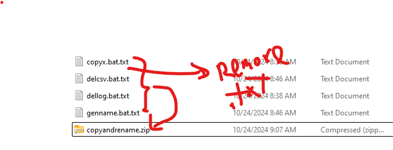

# 241023 Automate JPEG File Renaming 10,000 Times
to copy a JPEG file to the specified folder by the pre-defined namelist in the csv file.

## Windows Command Prompt Package
the package consists of 4 files.
1. genname.bat ... for generating the pre-defined filename.
2. copyx.bat ... for copying the JPEG file.
3. dellog.bat ... for deleting the log files in the current path.
4. delcsv.bat ... for deleting the csv files in the current path.

## Other Solutions
they are in the [other_langs](src/other_langs/) folder.
1. Python
2. VBScript
3. PowerShell
4. Bash

## Demo
[Youtube demo here](https://youtu.be/Mwjq7R2btdM?si=Pa1_POSkPkyZhwDb)

